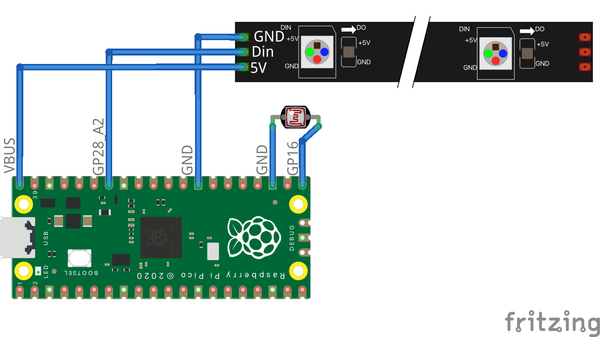

- [Project documentation template](7digitalProject.pptx)
- [Soldering tutorial video](https://tmccatholiceduau-my.sharepoint.com/:v:/g/personal/aknight_tmc_catholic_edu_au/ESbtkG_fkwNArYszbg9YyEsB2jNfQllsAZQTrPo3GYkt1g?e=XhicgF) (from [YouTube](https://www.youtube.com/watch?v=Qps9woUGkvI&pp=ygUSc29sZGVyaW5nIHR1dG9yaWFs))
- [Soldering cheat sheet](cheatsheet.pdf)
- [Night light design choices](7digitalProjectDesigns.pptx)
- [Pi Pico Firmware](https://downloads.circuitpython.org/bin/raspberry_pi_pico/en_US/adafruit-circuitpython-raspberry_pi_pico-en_US-8.0.5.uf2)
- [Neopixel library](neopixel.mpy)

## Problem definition 
Problem definition is the process we follow and considerations we make to determine and describe the problems we intend to solve.

### Describe Problems
Determining the nature and description of a 
problem to be solved. 

1. Identify the problem you wish to 
solve.  
2. What are the outcomes, what does it 
need to do? 
3. Identify the product client or clients (stakeholders). 
 
### Constraints
Constraints describe the restricting factors we face 
when solving problems, and how we factor these 
into our planned solutions. 

4. Describe the limitations or restricting 
factors your solution may face. 
 
### Decompose Problems
Breaking a problem down into smaller, simpler 
problems that can be solved separately.

5. What are the individual elements of 
the problem that can be solved 
separately to make the main problem 
more approachable/solvable?
 
### Project Plan
Developing an approach or strategy to solve a 
problem or create a solution that considers the 
sources of data, resources available and potential 
timeframes or deadlines. 

6. Develop a project plan based on 
time-scale and resources and key features of the 
project deliverables 
 
7. What are the logical steps to manage data files for 
the project? 

## Design 
Design algorithms captures the solution design we undertake to develop an automated solution to a problem.

<div class="mxgraph" style="max-width:100%;border:1px solid transparent;" data-mxgraph="{&quot;highlight&quot;:&quot;#0000ff&quot;,&quot;nav&quot;:true,&quot;resize&quot;:true,&quot;toolbar&quot;:&quot;zoom layers tags lightbox&quot;,&quot;edit&quot;:&quot;_blank&quot;,&quot;xml&quot;:&quot;&lt;mxfile host=\&quot;app.diagrams.net\&quot; modified=\&quot;2023-05-29T01:03:20.859Z\&quot; agent=\&quot;Mozilla/5.0 (Macintosh; Intel Mac OS X 10_15_7) AppleWebKit/605.1.15 (KHTML, like Gecko) Version/16.3 Safari/605.1.15\&quot; etag=\&quot;Ae5Cp8alQ_Nl-69zvpD8\&quot; version=\&quot;21.3.5\&quot;&gt;\n  &lt;diagram name=\&quot;Page-1\&quot; id=\&quot;theeIvWoAOZUXY_2hO-K\&quot;&gt;\n    &lt;mxGraphModel dx=\&quot;474\&quot; dy=\&quot;802\&quot; grid=\&quot;1\&quot; gridSize=\&quot;10\&quot; guides=\&quot;1\&quot; tooltips=\&quot;1\&quot; connect=\&quot;1\&quot; arrows=\&quot;1\&quot; fold=\&quot;1\&quot; page=\&quot;1\&quot; pageScale=\&quot;1\&quot; pageWidth=\&quot;827\&quot; pageHeight=\&quot;1169\&quot; math=\&quot;0\&quot; shadow=\&quot;0\&quot;&gt;\n      &lt;root&gt;\n        &lt;mxCell id=\&quot;0\&quot; /&gt;\n        &lt;mxCell id=\&quot;1\&quot; parent=\&quot;0\&quot; /&gt;\n        &lt;mxCell id=\&quot;BtPJ0RQ9yB9yxvm4DMkY-9\&quot; style=\&quot;edgeStyle=orthogonalEdgeStyle;rounded=0;orthogonalLoop=1;jettySize=auto;html=1;entryX=0;entryY=0.5;entryDx=0;entryDy=0;\&quot; edge=\&quot;1\&quot; parent=\&quot;1\&quot; source=\&quot;BtPJ0RQ9yB9yxvm4DMkY-2\&quot; target=\&quot;BtPJ0RQ9yB9yxvm4DMkY-3\&quot;&gt;\n          &lt;mxGeometry relative=\&quot;1\&quot; as=\&quot;geometry\&quot; /&gt;\n        &lt;/mxCell&gt;\n        &lt;mxCell id=\&quot;BtPJ0RQ9yB9yxvm4DMkY-2\&quot; value=\&quot;Input\&quot; style=\&quot;rounded=0;whiteSpace=wrap;html=1;fontFamily=Atkinson Hyperlegible;fontSource=https%3A%2F%2Ffonts.googleapis.com%2Fcss%3Ffamily%3DAtkinson%2BHyperlegible;fontStyle=0;fontSize=14;\&quot; vertex=\&quot;1\&quot; parent=\&quot;1\&quot;&gt;\n          &lt;mxGeometry x=\&quot;80\&quot; y=\&quot;280\&quot; width=\&quot;80\&quot; height=\&quot;40\&quot; as=\&quot;geometry\&quot; /&gt;\n        &lt;/mxCell&gt;\n        &lt;mxCell id=\&quot;BtPJ0RQ9yB9yxvm4DMkY-10\&quot; style=\&quot;edgeStyle=orthogonalEdgeStyle;rounded=0;orthogonalLoop=1;jettySize=auto;html=1;entryX=0;entryY=0.5;entryDx=0;entryDy=0;\&quot; edge=\&quot;1\&quot; parent=\&quot;1\&quot; source=\&quot;BtPJ0RQ9yB9yxvm4DMkY-3\&quot; target=\&quot;BtPJ0RQ9yB9yxvm4DMkY-4\&quot;&gt;\n          &lt;mxGeometry relative=\&quot;1\&quot; as=\&quot;geometry\&quot; /&gt;\n        &lt;/mxCell&gt;\n        &lt;mxCell id=\&quot;BtPJ0RQ9yB9yxvm4DMkY-3\&quot; value=\&quot;Processing\&quot; style=\&quot;rounded=0;whiteSpace=wrap;html=1;fontFamily=Atkinson Hyperlegible;fontSource=https%3A%2F%2Ffonts.googleapis.com%2Fcss%3Ffamily%3DAtkinson%2BHyperlegible;fontStyle=0;fontSize=14;\&quot; vertex=\&quot;1\&quot; parent=\&quot;1\&quot;&gt;\n          &lt;mxGeometry x=\&quot;200\&quot; y=\&quot;280\&quot; width=\&quot;80\&quot; height=\&quot;40\&quot; as=\&quot;geometry\&quot; /&gt;\n        &lt;/mxCell&gt;\n        &lt;mxCell id=\&quot;BtPJ0RQ9yB9yxvm4DMkY-4\&quot; value=\&quot;Output\&quot; style=\&quot;rounded=0;whiteSpace=wrap;html=1;fontFamily=Atkinson Hyperlegible;fontSource=https%3A%2F%2Ffonts.googleapis.com%2Fcss%3Ffamily%3DAtkinson%2BHyperlegible;fontStyle=0;fontSize=14;\&quot; vertex=\&quot;1\&quot; parent=\&quot;1\&quot;&gt;\n          &lt;mxGeometry x=\&quot;320\&quot; y=\&quot;280\&quot; width=\&quot;80\&quot; height=\&quot;40\&quot; as=\&quot;geometry\&quot; /&gt;\n        &lt;/mxCell&gt;\n        &lt;mxCell id=\&quot;BtPJ0RQ9yB9yxvm4DMkY-5\&quot; value=\&quot;&amp;lt;p&amp;gt;Sensors&amp;lt;br&amp;gt;&amp;lt;/p&amp;gt;\&quot; style=\&quot;text;html=1;strokeColor=none;fillColor=none;spacing=5;spacingTop=-20;whiteSpace=wrap;overflow=hidden;rounded=0;fontFamily=Atkinson Hyperlegible;fontSource=https%3A%2F%2Ffonts.googleapis.com%2Fcss%3Ffamily%3DAtkinson%2BHyperlegible;\&quot; vertex=\&quot;1\&quot; parent=\&quot;1\&quot;&gt;\n          &lt;mxGeometry x=\&quot;80\&quot; y=\&quot;330\&quot; width=\&quot;80\&quot; height=\&quot;30\&quot; as=\&quot;geometry\&quot; /&gt;\n        &lt;/mxCell&gt;\n        &lt;mxCell id=\&quot;BtPJ0RQ9yB9yxvm4DMkY-7\&quot; value=\&quot;&amp;lt;p&amp;gt;Algorithms&amp;lt;/p&amp;gt;&amp;lt;p&amp;gt;Code&amp;lt;/p&amp;gt;\&quot; style=\&quot;text;html=1;strokeColor=none;fillColor=none;spacing=5;spacingTop=-20;whiteSpace=wrap;overflow=hidden;rounded=0;fontFamily=Atkinson Hyperlegible;fontSource=https%3A%2F%2Ffonts.googleapis.com%2Fcss%3Ffamily%3DAtkinson%2BHyperlegible;\&quot; vertex=\&quot;1\&quot; parent=\&quot;1\&quot;&gt;\n          &lt;mxGeometry x=\&quot;200\&quot; y=\&quot;330\&quot; width=\&quot;80\&quot; height=\&quot;50\&quot; as=\&quot;geometry\&quot; /&gt;\n        &lt;/mxCell&gt;\n        &lt;mxCell id=\&quot;BtPJ0RQ9yB9yxvm4DMkY-8\&quot; value=\&quot;&amp;lt;p&amp;gt;?&amp;lt;/p&amp;gt;\&quot; style=\&quot;text;html=1;strokeColor=none;fillColor=none;spacing=5;spacingTop=-20;whiteSpace=wrap;overflow=hidden;rounded=0;fontFamily=Atkinson Hyperlegible;fontSource=https%3A%2F%2Ffonts.googleapis.com%2Fcss%3Ffamily%3DAtkinson%2BHyperlegible;\&quot; vertex=\&quot;1\&quot; parent=\&quot;1\&quot;&gt;\n          &lt;mxGeometry x=\&quot;320\&quot; y=\&quot;330\&quot; width=\&quot;80\&quot; height=\&quot;50\&quot; as=\&quot;geometry\&quot; /&gt;\n        &lt;/mxCell&gt;\n      &lt;/root&gt;\n    &lt;/mxGraphModel&gt;\n  &lt;/diagram&gt;\n&lt;/mxfile&gt;\n&quot;}">

### Input
8. Describe the sensor(s) to be used and why? 
9. What data will be collected from each sensor?

### Processing
10. Design the algorithms for the solution (use [app.diagrams.net](https://app.diagrams.net))
 
### Output
11. What is the output? 
12. What is be turned on/off or controlled?

### Processing
13. List the variables and their data type required. 

### Connection Diagram
14. Draw and label a detailed connection diagram. 
 
